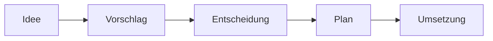

# Leitfaden: denkspur lernen

> Dieser Text führt in die Methode ein, wie man sie **lernt**, nicht wie man
> sie nachschlägt: erst das Problem, dann die Lösung, Schritt für Schritt,
> mit einem durchgängigen Beispiel. Die knappe Referenz steht in
> [`methode/`](methode/); die Kurzfassung für Agenten in [`AGENTS.md`](AGENTS.md).
> Maßgeblich ist `methode/` — Leitfaden und Agenten-Kurzfassung sind
> abgeleitete Darstellungen derselben Regeln.

## 1. Das Problem: Projekte vergessen

Jeder kennt diese vier Momente:

1. **„Warum haben wir das nochmal so gebaut?"** Die Begründung steckte in
   einem Chat-Verlauf, einem Call oder einem Kopf — sie ist weg. Also wird
   die Entscheidung neu aufgerollt, oft mit demselben Ergebnis, immer mit
   neuen Kosten.
2. **„Wo liegt das nochmal?"** Die Ablage ist gewachsen statt geplant. Jede
   Suche kostet Minuten, jede neue Datei verschärft das Problem.
3. **„Das hatten wir doch schonmal verworfen."** Die abgelehnte Option wurde
   nirgends festgehalten — also schlägt sie jemand (oder ein KI-Agent) guten
   Gewissens erneut vor.
4. **„Sieht ganz anders aus, als ich dachte."** Das Feature ist fertig
   gebaut — und gefällt nicht. Die teuerste Art, ein Layout abzulehnen, ist
   die nach der Umsetzung.

Mit KI-Agenten verschärft sich alles: Ein Agent hat kein Gedächtnis über die
Session hinaus. Was nicht in der Ablage steht, muss er in jeder Session neu
erklärt bekommen — **Kontext gehört in die Ablage, nicht in den Chat.**

## 2. Die Antwort: zwei Achsen und ein Vertrag

denkspur beantwortet die vier Momente mit zwei Achsen:

- **Raum** (gegen Moment 2): eine vorhersehbare Struktur — jede Datei hat
  einen Ort, jeder Ort einen Zweck, jedes Projekt eine Tür.
- **Zeit** (gegen Momente 1 und 3): eine Spur — jeder tragende Gedanke
  durchläuft nachvollziehbare Stationen, und nichts Entschiedenes wird je
  wegeditiert.
- Dazu eine Abnahme-Regel (gegen Moment 4): **Abnahme am günstigsten
  Medium** — Text vor Bild vor Code.

Was die Methode damit verspricht, steht als neun Zusagen in
[Kapitel 1](methode/01-vertrag.md). Den Rest dieses Leitfadens verbringen wir
damit, die Methode an einem Beispiel aufzubauen.

## 3. Der Raum: ein Projekt bekommt eine Form

Angenommen, wir betreiben eine kleine Web-App für Rezepte und wollen sie
methodisch führen. Wir kopieren das [`starter/`](starter/)-Skelett und haben:

```
rezept-app/
├── README.md          ← die Tür: Zweck, Aufbau, Einstieg
├── AGENTS.md          ← Regeln für den KI-Agenten
├── ideen/  entscheidungen/  plaene/     ← die Spur (kommt gleich)
├── _quellen/          ← Rohmaterial, unverändert
├── 01-fachwissen/     ← aufbereitetes Wissen
└── ergebnisse/        ← erzeugte Artefakte
```

Drei Regeln reichen für den Anfang: **eine Tür je Projekt** (die README
orientiert in fünf Minuten), **getrennte Lebensbereiche** (Rohes, Wissen,
Erzeugtes mischen sich nie) und **langweilige Namen** (kleingeschrieben,
bindestrich-getrennt, keine Umlaute in Dateinamen). Alles Weitere:
[Kapitel 2](methode/02-struktur.md).

## 4. Die Zeit: ein Gedanke geht auf die Reise

Jetzt das Herzstück. Eine Nutzerin schreibt uns: *„Ich finde meine
Lieblingsrezepte nicht wieder."* Daraus wird ein Gedanke — und der bekommt
einen Lebenslauf:



### Station 1: Die Idee (drei Zeilen, dreißig Sekunden)

Wir halten den Gedanken fest, bevor er im Alltag stirbt — zum minimalen
Preis, als `ideen/0007-merkliste.md`:

```markdown
---
typ: idee
status: keim
datum: 2026-07-06
---

# Idee 0007: Merkliste

Nutzer finden Lieblingsrezepte nicht wieder. Eine Merkliste
(Favoriten-Stern am Rezept, eigene Listenansicht) könnte das lösen.
```

Status `keim` heißt: festgehalten, nicht bewertet. Die Idee darf hier
monatelang liegen, Kinder bekommen (`Eltern-Idee:`-Link) oder als
`verworfen` enden — auch das ist ein dokumentiertes Ergebnis.

### Station 2: Der Vorschlag (die Optionen auf den Tisch)

Die Idee trägt. Wir befördern sie zu einem **Entscheidungs-Vorschlag** — ein
ADR (Architecture Decision Record), das bewährte Standardformat dafür — als
`entscheidungen/0009-merkliste.md` mit Status `vorgeschlagen`:

```markdown
---
typ: entscheidung
status: vorgeschlagen
datum: 2026-07-08
---

# 0009: Merkliste für angemeldete Nutzer

Hervorgegangen aus: [Idee 0007](../ideen/0007-merkliste.md)

## Kontext
Nutzer finden Lieblingsrezepte nicht wieder. …

## Erwogene Optionen
1. Merkliste nur für angemeldete Nutzer (serverseitig gespeichert)
2. Merkliste im Browser (localStorage, kein Login nötig)
3. Keine Merkliste, stattdessen bessere Suche

## Entscheidung
(offen)
```

Die Idee bekommt den Rück-Link `Befördert zu:` und den Status `befördert` —
beide Enden der Beziehung sind verlinkt.

### Station 3: Die Entscheidung (der Status kippt)

Nach Abwägung fällt die Wahl auf Option 2 (kein Login-Zwang, geringster
Aufwand). **Dieselbe Datei** wird vervollständigt: Status `angenommen`, die
Entscheidung samt Begründung eingetragen, die verworfenen Optionen bleiben
stehen. Ab jetzt gilt die eiserne Regel: **Diese Datei wird nie wieder
umgeschrieben.** Stellt sich die Entscheidung später als falsch heraus,
entsteht ein neues ADR mit `Ersetzt: 0009` — die Spur bleibt lückenlos.

Genau das rettet uns in sechs Monaten: Schlägt jemand vor, „doch mal eine
serverseitige Merkliste zu bauen", zeigt 0009, dass die Option erwogen und
warum sie verworfen wurde.

### Station 4: Der Plan (mit Design-Gate)

Die angenommene Entscheidung bekommt einen Plan,
`plaene/0004-merkliste.md`:

```markdown
---
typ: plan
status: entwurf
datum: 2026-07-09
---

# Plan 0004: Merkliste umsetzen

Setzt um: [Entscheidung 0009](../entscheidungen/0009-merkliste.md)

## Design-Gate
- [ ] Entwurf (Stern am Rezept, Listenansicht) in Figma skizziert
- [ ] Entwurf visuell abgenommen
      → Beleg: ../ergebnisse/abnahmen/merkliste-entwurf.png

## Aufgaben
- [ ] Favoriten-Zustand in localStorage speichern
- [ ] Stern-Schaltfläche an der Rezeptkarte
- [ ] Ansicht „Meine Merkliste"
```

Das **Design-Gate** ist Moment 4 aus Abschnitt 1, gelöst: Weil die Merkliste
sichtbare Oberfläche hat, wird ihr Aussehen zuerst am billigsten tauglichen
Medium abgenommen — ein Figma-Entwurf, notfalls ein Bild-Mockup. Ein „der
Stern ist zu dominant" kostet am Bild fünf Minuten; am fertigen Code kostet
es einen Nachmittag. Erst nach der visuellen Abnahme beginnt die
Code-Umsetzung. (Für einen umbenannten Button braucht niemand Figma — das
Gate greift, wo Layout oder Fluss neu entstehen.) Der abgenommene Stand wird
als Bild unter `ergebnisse/abnahmen/` versioniert — ein bloßer Figma-Link
altert und ist für Dritte oft unzugänglich.

### Station 5: Die Umsetzung (Checkboxen wandern)

Der Plan geht auf `aktiv`, die Checkboxen werden abgehakt, am Ende steht
`fertig`. Damit ist die Reise komplett: Von der Nutzerbeschwerde bis zum
Feature ist jeder Schritt ein kleines Markdown-Artefakt — billig erzeugt,
dauerhaft nachvollziehbar.

## 5. Den Überblick behalten

Zwei Hilfsdateien halten das Ganze übersichtlich, beide billig:

- **`uebersicht.md`** — drei Tabellen (Ideen, Entscheidungen, Pläne) mit
  Status und Datum, funktioniert als To-do-Tafel. Sie wird per Skript
  (`skripte/uebersicht-generieren.ps1` bzw. `.sh`) aus den Artefakt-Köpfen
  **komplett neu generiert**, nie von Hand geflickt — die Artefakte bleiben
  die einzige Wahrheit, und die Fleißarbeit kostet weder Zeit noch Tokens.
- **`logbuch.md`** — ein formloses Arbeitstagebuch, neueste Einträge zuerst.
  Der billigste Wiedereinstieg nach zwei Wochen Pause.

## 6. Der Agent als Schreibkraft mit Freigabe-Regel

In der Praxis schreibt die Artefakte meist ein KI-Agent: Man beschreibt im
Gespräch, der Agent strukturiert, legt Dateien an, pflegt Links und
Übersicht. Jedes Projekt deklariert in seiner `AGENTS.md` einen von zwei
**Freigabe-Modi**:

1. **Gespräch** (Default): Der Agent schlägt frei vor, handelt aber erst auf
   ausdrückliche Freigabe — und weil ein bloßes „ja" mehrdeutig ist (gilt es
   dem einen Artefakt oder dem ganzen Paket?), benennt er vor dem Handeln,
   was er unter der Freigabe versteht.
2. **PR-Gate** (für autonome Workflows): Der Agent arbeitet frei auf einem
   Feature-Branch; die Freigabe ist der Merge des Pull Requests — die
   Reichweite des „Ja" ist der sichtbare Diff.

Die Regeln für Agenten stehen maschinenlesbar in [`AGENTS.md`](AGENTS.md) —
in jedem denkspur-Projekt, auch in diesem.

## 7. Wann denkspur nicht lohnt

Eine Methode, die ihre Grenzen nicht benennt, ist ein Prospekt. denkspur
kostet Disziplin und ein paar Minuten je Artefakt — das lohnt nicht immer:

- **Wegwerf-Arbeit:** Spikes, Experimente, Einmal-Skripte. Wo es keinen
  Wiedereinstieg gibt, braucht es keine Spur.
- **Ein-Tages-Aufgaben** mit einer beteiligten Person und ohne
  Folgeentscheidungen — der Chat-Verlauf stirbt hier zu Recht.
- **Reine Konsum-Ablagen** (Downloads, Archive), die niemand fortschreibt.
- **Triviale, jederzeit umkehrbare Alltagsentscheidungen** — ein ADR für
  jede Button-Farbe wäre Zeremonie, nicht Methode.

Faustregel: Die Spur lohnt ab dem Moment, in dem eine zweite Person, eine
zweite Session oder ein zweiter Monat ins Spiel kommt. Und die Methode
skaliert nach unten: Wer nur `entscheidungen/` übernimmt, hat schon den
größten Hebel gegen das teuerste Vergessen.

## 8. Selbst anfangen

1. Inhalt von [`starter/`](starter/) ins eigene Projekt kopieren.
2. `README.md` (die Tür) und `AGENTS.md` (die Regeln) füllen — die
   Platzhalter zeigen, was hingehört.
3. Die erste Idee anlegen. Nicht auf Vollständigkeit warten: Die Struktur
   wächst mit der Arbeit, nicht vor ihr.
4. Bei Fragen: [`methode/`](methode/) ist die Referenz — Vertrag, Struktur,
   Lebenslauf, Zusammenarbeit.

Dieses Repo selbst ist das zweite Beispiel: Es führt seine eigenen
Entscheidungen als Spur unter [`entscheidungen/`](entscheidungen/) — dort
kann man nachlesen, warum denkspur so ist, wie es ist.
