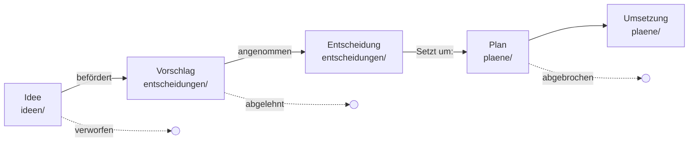

# Kapitel 3 — Lebenslauf: die Zeit

> Wie ein Gedanke durch das Projekt reist — von der ersten Notiz bis zur
> abgehakten Umsetzung — und warum in sechs Monaten noch nachvollziehbar ist,
> *warum* etwas so ist und was verworfen wurde. Dieses Kapitel übernimmt den
> Kern von [decision-trail](https://github.com/ckluth/decision-trail)
> (Zusage 9: leihen statt erfinden), eingedeutscht per
> [Entscheidung 0002](../entscheidungen/0002-deutsch-als-methodensprache.md).

## 3.1 Die fünf Stationen



| Station | Ort | Status-Werte |
|---|---|---|
| **Idee** | `ideen/NNNN-*.md` | `keim` → `befördert` / `verworfen` |
| **Vorschlag** | `entscheidungen/NNNN-*.md` | `vorgeschlagen` |
| **Entscheidung** | dieselbe Datei | `angenommen` / `abgelehnt` |
| **Plan** | `plaene/NNNN-*.md` | `entwurf` → `aktiv` |
| **Umsetzung** | dieselbe Datei | → `fertig` / `abgebrochen` |

- **Idee**: hält einen Gedanken zum minimalen Preis fest — drei Zeilen
  reichen. Ideen dürfen Kinder bekommen (`Eltern-Idee:`), die Verwandtschaft
  bleibt verlinkt (Zusage 6).
- **Vorschlag**: eine gereifte Idee wird zum ADR (Architecture Decision
  Record nach Nygard): Kontext, Entscheidungstreiber, erwogene Optionen,
  Entscheidung, Konsequenzen. Vorlage: `_templates/entscheidung-vorlage.md`.
- **Entscheidung**: dieselbe Datei, der Status kippt auf `angenommen` oder
  `abgelehnt`. Begründung und Ergebnis bleiben beieinander — auch eine
  **abgelehnte** Option ist dokumentiert, damit niemand sie erneut aufrollt.
- **Plan**: übersetzt eine angenommene Entscheidung in konkrete Aufgaben
  (Checkboxen). Bei Vorhaben mit Benutzeroberfläche enthält der Plan ein
  **Design-Gate** (Kapitel 4.2).
- **Umsetzung**: die Checkboxen wandern; am Ende `fertig` oder `abgebrochen`.

## 3.2 Artefakt-Format

Jedes Lebenslauf-Artefakt trägt Metadaten im Frontmatter (Zusage 4) und die
Beziehungs-Links als klickbare Zeilen direkt unter der Überschrift (damit sie
auf GitHub und in Obsidian als Links funktionieren):

```markdown
---
typ: entscheidung
status: angenommen
datum: 2026-07-06
tags: [oberflaeche]
---

# 0009: Merkliste für angemeldete Nutzer

Hervorgegangen aus: [Idee 0007](../ideen/0007-merkliste.md)

## Kontext
…
```

**Nummerierung:** vierstellig, fortlaufend, je Familie unabhängig
(`ideen/0007-…` und `entscheidungen/0009-…` haben nichts miteinander zu tun).
Nummern drücken **nur Reihenfolge** aus, nie Beziehungen — Beziehungen drücken
ausschließlich die Links aus.

## 3.3 Das Querverweis-Vokabular

| Von | Feld | Nach | Art |
|---|---|---|---|
| Idee | `Eltern-Idee:` | Idee | Knospung, nur vorwärts |
| Idee | `Befördert zu:` | Entscheidung | Beförderung, **wechselseitig** |
| Entscheidung | `Hervorgegangen aus:` | Idee | Rück-Link der Beförderung |
| Entscheidung | `Ergänzt:` / `Ergänzt durch:` | Entscheidung | spätere Entscheidung ändert frühere punktuell, **wechselseitig** |
| Entscheidung | `Ersetzt:` / `Ersetzt durch:` | Entscheidung | spätere Entscheidung löst frühere komplett ab, **wechselseitig** |
| Plan | `Setzt um:` | Entscheidung | Plan trägt Entscheidung aus, nur vorwärts |

Wechselseitige Links stehen in **beiden** Dateien; Nur-vorwärts-Links
verschonen ältere Artefakte vor wachsenden Rückverweis-Listen.

**Die eiserne Regel:** Eine Entscheidung wird **nie wegeditiert** (Zusage 8).
Ändert sich die Lage, entsteht ein neues ADR, das das alte `Ergänzt:` oder
`Ersetzt:` — die Begründungsspur bleibt lückenlos lesbar. Nur ein noch nicht
committeter Vorschlag darf in place überarbeitet werden.

## 3.4 Die Übersicht: generiert, nie handgepflegt

`uebersicht.md` ist ein **abgeleiteter** Statusindex: drei Tabellen (Ideen,
Entscheidungen, Pläne) mit Nummer, Titel, Status, Datum und Tags, gestempelt
mit „Stand: <Datum>". Sie funktioniert als To-do- und Erledigt-Tafel.

Regeln:

1. Die Übersicht wird **komplett neu generiert** aus den Artefakt-Köpfen —
   nie von Hand geflickt. Quelle der Wahrheit sind allein die Artefakte
   (Zusage 2).
2. Der Agent erneuert sie nach jeder Änderung an der Spur: Familien scannen,
   drei Tabellen neu schreiben, Datum stempeln.

## 3.5 Kontinuität: Logbuch und Zwischenstände

- **`logbuch.md`** (optional, empfohlen): formloses Arbeitstagebuch, neueste
  Einträge zuerst — wo steht die Arbeit, was hat sich verschoben, was ist
  offen. Der billigste Wiedereinstieg nach einer Pause; wird nach Konvention
  am Session-Ende ergänzt, ohne Pflicht und ohne Freigabe-Zeremonie.
- **`_zwischenstand/`** (optional): Arbeitsablage für Pläne — Daten, Befunde,
  Entwürfe — ohne die Quelle der Wahrheit zu berühren. Inhalt ist
  wegwerfbar; was Bestand haben soll, zieht in einen Arbeitsbereich um.

## 3.6 Änderungen an der Methode selbst

Wer denkspur anpasst — im eigenen Projekt oder in diesem Repo — behandelt die
Änderung wie jeden anderen Gedanken: als Idee festhalten, per ADR entscheiden,
mit Querverweisen einhängen. Die Methode dokumentiert sich selbst; dieses Repo
lebt das vor (siehe [`entscheidungen/`](../entscheidungen/)).

## Verknüpfungen

- [Kapitel 2 — Struktur (der Raum)](02-struktur.md)
- [Kapitel 4 — Zusammenarbeit](04-zusammenarbeit.md)
- [Vorlagen](../starter/_templates/)
